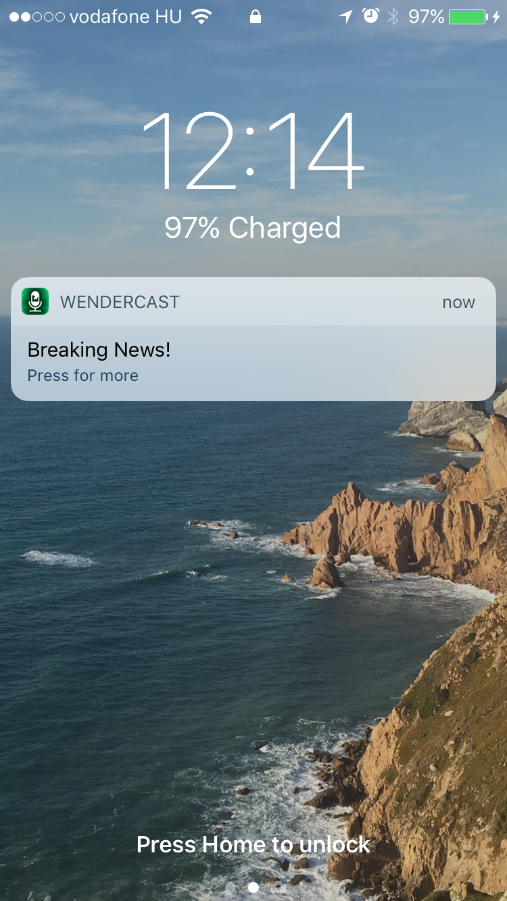

WenderCast
==========
Push notifications have become more and more powerful since they were first introduced. In iOS 10, push notifications can:

- Display a short text message
- Play a notification sound
- Set a badge number on the app’s icon
- Provide actions the user can take without opening the app
- Show a media attachment
- Be silent, allowing the app to wake up in the background and perform a task

This push notifications tutorial will go over how push notifications work, and let you try out their features.

## Screenshots

---
Source: [Push Notifications Tutorial: Getting Started](https://www.raywenderlich.com/156966/push-notifications-tutorial-getting-started)
